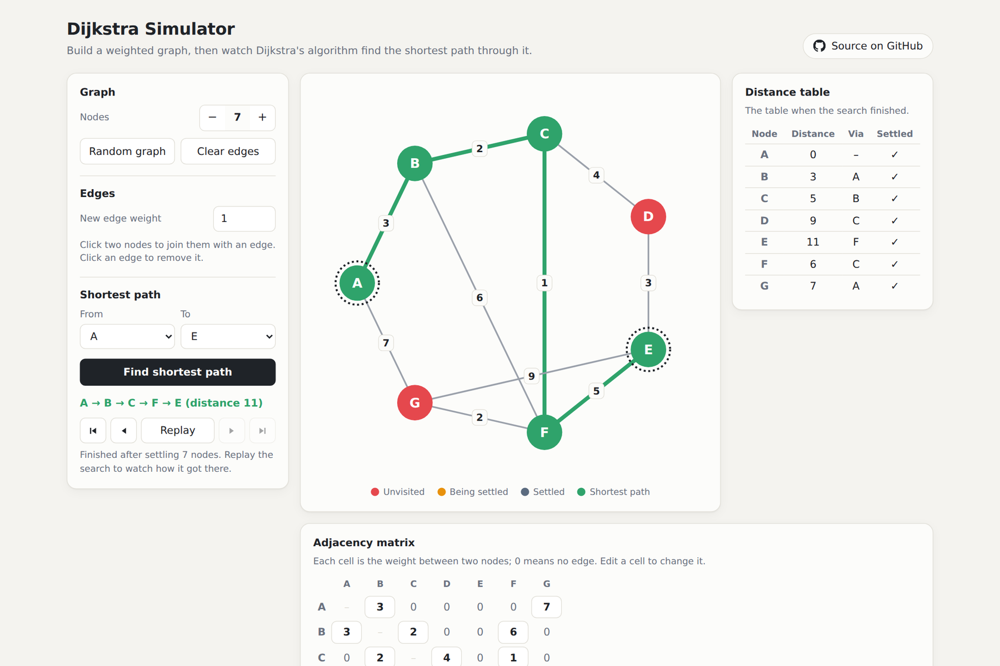
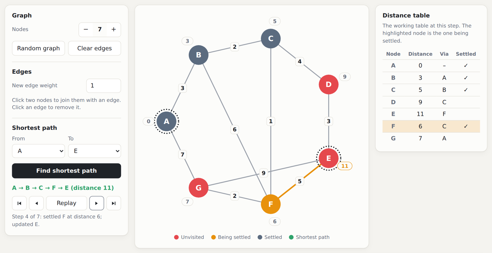
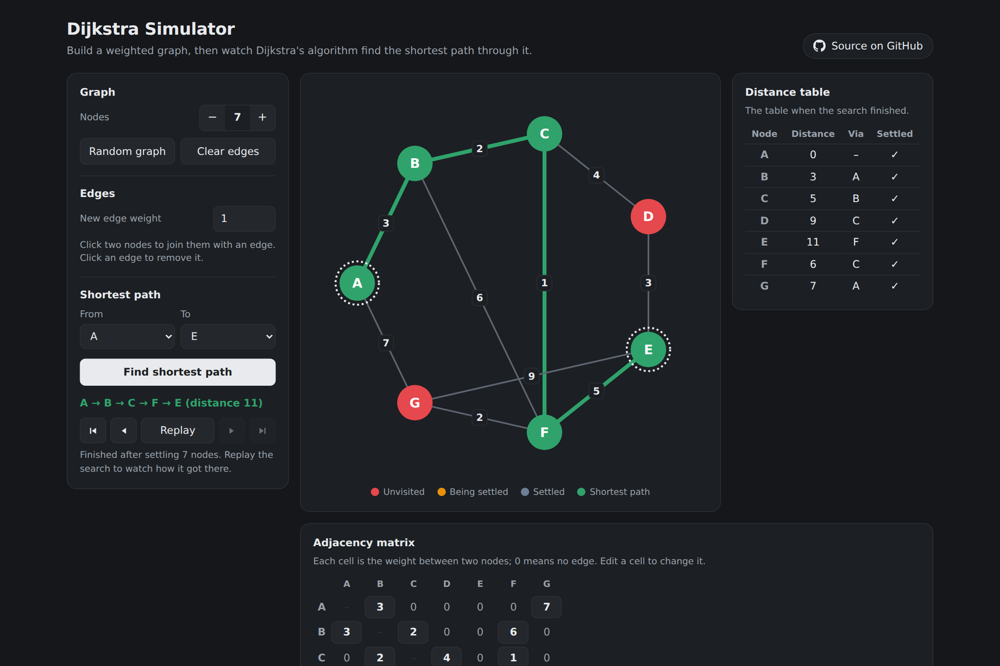
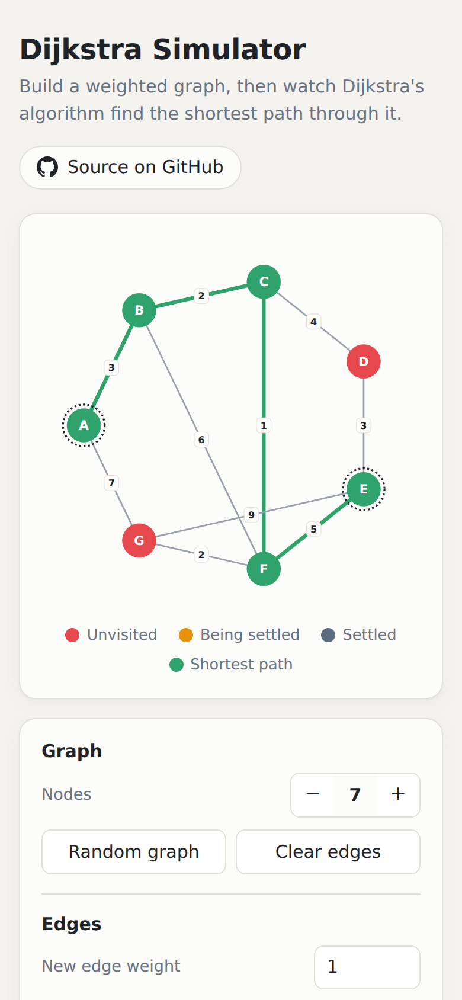

# Dijkstra Simulator

<!-- tags:start -->
    
<!-- tags:end -->

[](https://github.com/DickinsonAlex/Dijkstra-Simulator/actions/workflows/ci.yml)
[](https://dotnet.microsoft.com/)
[](LICENSE)

Build a weighted graph, then watch **Dijkstra's shortest-path algorithm** work through it one step at a time.

**[▶ Try it in your browser](https://dijkstra.alexxdickinson.co.uk)** · also runs as a Windows desktop app



## Features

- **Build a graph by clicking.** Click two nodes to join them with an edge of any weight, click an edge to remove it, or generate a random connected graph.
- **Edit the adjacency matrix directly.** The matrix stays in sync with the drawing, and typing a weight into a cell adds, changes or removes that edge.
- **Find the shortest path** between any two nodes. The route is highlighted in green along with its total distance, or you're told there's no route.
- **Step through the search.** Replay it, or go back and forth one step at a time. Each step shows which node is being settled, which distances were updated and the working distance table, just like a worked exam answer.
- **Works anywhere.** The web version follows your light or dark mode setting and fits phone screens.
- **Two front ends, one algorithm.** The web and desktop apps share the same VB.NET library for the graph and the search.

| Stepping through the search | Dark mode | On a phone |
| --- | --- | --- |
|  |  |  |

## How the search works

The graph is undirected and stored as an **adjacency matrix**, where `0` means "no edge". `Dijkstra.FindShortestPath` (in [`Dijkstra.vb`](src/DijkstraSimulator.Core/Dijkstra.vb)) keeps three things for every node: its best-known distance from the start, the node it was reached from, and whether it has been settled.

1. Set every distance to ∞, except the start node, which is 0.
2. Settle the unvisited node with the smallest known distance. Its distance is now final.
3. **Relax** each of its edges. If going through this node gives a neighbour a shorter distance, record the new distance and where it came from.
4. Repeat from step 2 until the destination is settled, or until no reachable nodes are left (so there's no route).
5. Follow the "reached from" links back from the destination to recover the route.

Finding the closest node is a simple linear scan, which makes the search **O(V²)**. With at most 26 nodes, this beats a priority queue in practice. A snapshot of the table is saved after each settle, and those snapshots drive the step-through view.

The core library is covered by unit tests, including a check against a brute-force search on 200 random graphs.

## Project structure

```text
src/
├── DijkstraSimulator.Core/      VB.NET class library: the graph, Dijkstra's algorithm and the circular layout
├── DijkstraSimulator.Desktop/   VB.NET Windows Forms app
└── DijkstraSimulator.Web/       Blazor WebAssembly app (C#/Razor UI on top of the VB.NET core)
tests/
└── DijkstraSimulator.Core.Tests/  xUnit tests for the core library
```

## Running it locally

You'll need the [.NET 10 SDK](https://dotnet.microsoft.com/download/dotnet/10.0). In Visual Studio, use Visual Studio 2026 or later.

```bash
# Web app, served at http://localhost:5080
dotnet run --project src/DijkstraSimulator.Web

# Desktop app (Windows only)
dotnet run --project src/DijkstraSimulator.Desktop

# Tests
dotnet test
```

Or open `DijkstraSimulator.slnx` in Visual Studio and pick a start-up project.

## Deployment

Every push to `main` runs [GitHub Actions](.github/workflows/ci.yml), which builds the solution and runs the tests. The workflow then publishes the web app and deploys the static files to **Cloudflare Pages** with Wrangler. The site is plain static files (HTML, CSS and WebAssembly), so it needs no server.

## Background

I made this in 2022 for my A-Level Computer Science course, as a Windows Forms app for building graphs and viewing their adjacency matrix. In 2026 I rebuilt it:

- the graph and search logic moved into a tested class library;
- the desktop app was upgraded from .NET Core 3.1 to .NET 10, and its drawing was reworked so the graph no longer disappears when the window is resized;
- the unfinished second window was merged into the main one;
- the search can now be stepped through;
- a Blazor WebAssembly front end was added so the simulator runs in any browser.

The original version is kept on the [`submission`](https://github.com/DickinsonAlex/Dijkstra-Simulator/tree/submission) branch.

## Credits

Made by [Alex Dickinson](https://alexxdickinson.co.uk). Released under the [MIT licence](LICENSE).
