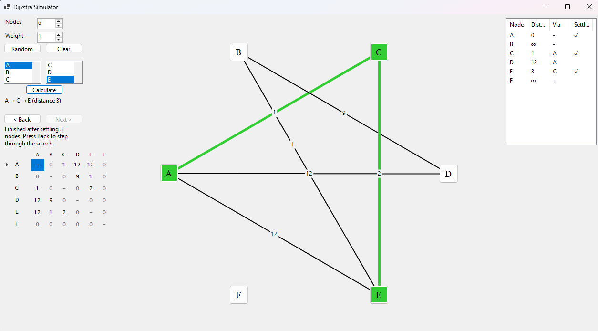

# Dijkstra Simulator

<!-- tags:start -->
    
<!-- tags:end -->

[](https://github.com/DickinsonAlex/Dijkstra-Simulator/actions/workflows/ci.yml?query=branch%3Asubmission)
[](https://dotnet.microsoft.com/)
[](LICENSE)

A Windows desktop app, written entirely in **VB.NET**, for building a weighted graph and watching **Dijkstra's shortest-path algorithm** work through it one step at a time. I made it for my A-Level Computer Science course.

> This is the `submission` branch: the VB.NET desktop version on its own. The [`main`](https://github.com/DickinsonAlex/Dijkstra-Simulator) branch also runs the same code in a web browser.


## Features

- **Build a graph by clicking.** Choose how many nodes you want (2–15), click two nodes to join them with an edge of any weight, and click an edge to remove it. There's also a button to generate a random connected graph.
- **Edit the adjacency matrix directly.** The matrix below the controls stays in sync with the drawing, and typing a weight into a cell adds, changes or removes that edge.
- **Find the shortest path** between any two nodes. The route is highlighted in green along with its total distance, or you're told there's no route.
- **Step through the search.** Go back and forth one step at a time. Each step shows which node is being settled, which distances were updated and the working distance table, just like a worked exam answer.
- **Scales properly.** The graph redraws itself when the window is resized, and the app is sharp on high-DPI screens.



## How the search works

The graph is undirected and stored as an **adjacency matrix**, where `0` means "no edge". `Dijkstra.FindShortestPath` (in [`Dijkstra.vb`](src/DijkstraSimulator.Core/Dijkstra.vb)) keeps three things for every node: its best-known distance from the start, the node it was reached from, and whether it has been settled.

1. Set every distance to ∞, except the start node, which is 0.
2. Settle the unvisited node with the smallest known distance. Its distance is now final.
3. **Relax** each of its edges. If going through this node gives a neighbour a shorter distance, record the new distance and where it came from.
4. Repeat from step 2 until the destination is settled, or until no reachable nodes are left (so there's no route).
5. Follow the "reached from" links back from the destination to recover the route.

Finding the closest node is a simple linear scan, which makes the search **O(V²)**. With at most 26 nodes, this beats a priority queue in practice. A snapshot of the table is saved after each settle, and those snapshots drive the step-through view.

The algorithm is covered by unit tests, including a check against a brute-force search on 200 random graphs.

## Project structure

```text
src/
├── DijkstraSimulator.Core/      Class library: the graph, Dijkstra's algorithm and the circular layout
└── DijkstraSimulator.Desktop/   Windows Forms app
tests/
└── DijkstraSimulator.Core.Tests/  xUnit tests for the core library
```

All three projects are VB.NET.

## Running it

You'll need Windows and the [.NET 10 SDK](https://dotnet.microsoft.com/download/dotnet/10.0). In Visual Studio, use Visual Studio 2026 or later.

```bash
dotnet run --project src/DijkstraSimulator.Desktop
dotnet test
```

Or open `DijkstraSimulator.slnx` in Visual Studio and press F5.

## Background

The first version, from 2022, could build graphs and show their adjacency matrix. It targeted .NET Core 3.1, drew the graph straight onto the form (so it disappeared when the window was redrawn), and had an unfinished second window for adding nodes. This version:

- upgrades it to .NET 10;
- moves the graph and search into a tested class library;
- merges the two windows;
- redraws the graph properly;
- adds the working shortest-path search with step-through.

## Credits

Made by [Alex Dickinson](https://alexxdickinson.co.uk). Released under the [MIT licence](LICENSE).
